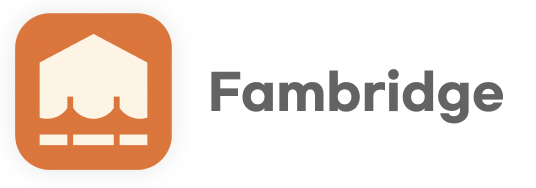

우리 가족의 소통공간, Fambridge

## 📚 목차 (Tabel of Contents)

<ol>
    <li><a href="#Introduce"> 프로젝트 소개 (Introduce Project)</a></li>
    <li><a href="#Function">기능 설명 (Detail of fuction)</a></li>
    <li><a href="#Team">팀 정보 (Team Information)</a></li>
    <li><a href="#License">저작권 및 사용권 정보 (Copyleft / End User License)</a></li>
  </ol>
  

<h2 id="Introduce"> 📣 프로젝트 소개</h2>

---

여러분은, 가족에 대해 얼마나 아시나요?

우리는 가족을 가장 가까운 사이라고 정의하지만,
생각보다 가족에 대해 잘 모르는 경우가 많습니다.

저희는 그 이유를 가족 간의 소통의 부재임을 정의했습니다.

조선일보는 하루 중 가족과의 대화 시간은 하루 20분 미만의 비율이 37.8 퍼센트로 우리가 생각하는 것보다 가족 소통의 부재가 큰 것을 확인할 수 있었습니다.

그 원인으로는 구성원간 소통하는 방식이 다르고 서로 시간이 없다는 것이였습니다.

그래서 저희 앱은 매일 5분의 시간을 통해 내가 그동안 몰랐던 가족의 이야기를 들을 수 있는 기회를 주고자 합니다.

<h2 id="Function"> 🔨 기능 설명</h2>

---

### ☝ 첫 번째, 오늘의 질문을 확인하여 나의 이야기도 공유하고 가족들의 알지 못했던 새로운 이야기를 봅니다.

이를 통해, 가족들은 어떠한 고민이 있는지, 요즘 뭐가 행복한지 다양한 주제에 대한 답변을 확인할 수 있습니다.

### ✌ 두 번째, 가볍게 답변해요.

긴 질문들은 상대적으로 부담을 주어 상대방이 답변하는 것을 꺼리게 하지만 핵심적이고 간단한 질문을 통해 가족들을 참여를 높입니다.

### 🙌 세번 째, 답변 포인트로 나무를 키워요

가족 구성원이 이야기를 공유할 때마다 포인트가 쌓여 팸 나무를 키우고 시각적으로 답변율을 보여줍니다.

<h2 id="Team"> 🏠 팀 정보</h2>

---

<h2 id="License"> 🔗 저작권 및 사용권 정보</h2>

---
